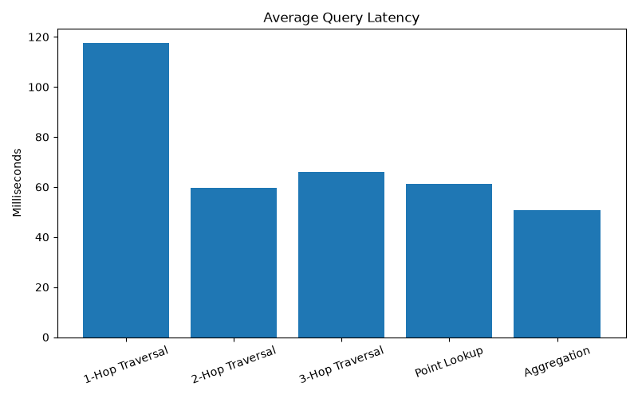
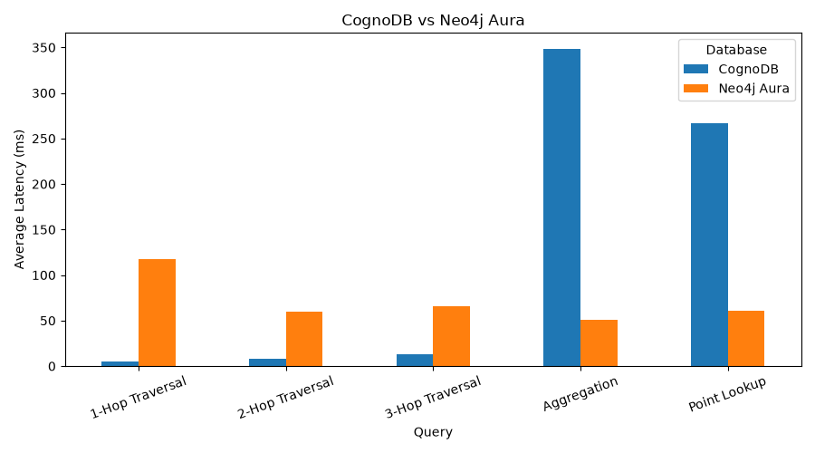

# graph-database-benchmark
Benchmarking CognoDB Cloud against managed graph databases using Python.
# Graph Database Benchmark

## Overview

This project benchmarks graph database performance using the Cit-HepTh citation network dataset.

The benchmark compares graph databases using identical workloads and measures query latency.

## Databases

- CognoDB
- Neo4j AuraDB

## Dataset

- Cit-HepTh
- Nodes: 27,770
- Relationships: 352,807

## Benchmark Queries

1. 1-Hop Traversal
2. 2-Hop Traversal
3. 3-Hop Traversal
4. Point Lookup
5. Aggregation

## Results

| Query | CognoDB Avg (ms) | Neo4j Aura Avg (ms) |
|-------|------------------:|--------------------:|
| 1-Hop Traversal | 5.21 | 117.40 |
| 2-Hop Traversal | 8.37 | 59.76 |
| 3-Hop Traversal | 12.63 | 66.14 |
| Point Lookup | 266.42 | 61.18 |
| Aggregation | 348.46 | 50.68 |

## Project Structure

```
benchmark/
dataset/
results/
charts/
README.md
requirements.txt
```

## How to Run

Install dependencies:

```bash
pip install -r requirements.txt
```

Load dataset:

```bash
python benchmark/loader.py
```

Run benchmark:

```bash
python -m benchmark.benchmark
```

Generate charts:

```bash
python -m benchmark.charts
```

## Output

- results/results.csv
- results/comparison.csv
- charts/average_latency.png
- charts/comparison.png

## Benchmark Charts

### Average Query Latency



### Database Comparison

